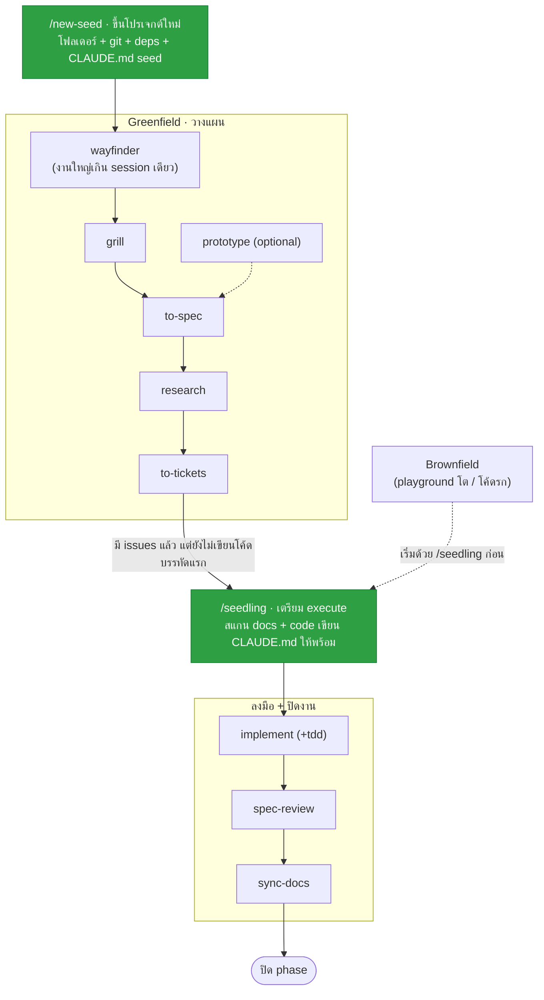

# harness-kit

ชุด **skill + command** สำหรับ Claude Code ที่ห่อกระบวนการทำงานตั้งแต่ต้นจนจบให้เป็นระบบ — ตั้งแต่ขึ้นโปรเจกต์ใหม่ ไล่จนถึงสะสางโค้ดเดิมที่รกให้พร้อมเพิ่มฟีเจอร์

แบ่งเป็น 2 ชุดใหญ่ตามสถานะของงาน + 2 command สำหรับตั้งต้นโปรเจกต์

> เนื้อหาใน skill/command เป็นภาษาอังกฤษ (Claude อ่าน) แต่เวลาใช้งานจริงมันจะตอบเป็นภาษาที่คุณคุยด้วย

---

## ติดตั้ง

```bash
git clone https://github.com/dhinsor/harness-kit.git
cd harness-kit
./install.sh
```

`install.sh` จะ copy ทุก skill เข้า `~/.claude/skills/` และทุก command เข้า `~/.claude/commands/` — ถ้ามีไฟล์ชื่อซ้ำอยู่แล้ว มันจะ **backup ตัวเก่าให้ก่อน** ไม่ทับทิ้งเงียบๆ เสร็จแล้วเปิด session ใหม่ของ Claude Code เพื่อให้มันเห็นของใหม่

จะ copy เองก็ได้ — แค่ลากโฟลเดอร์ใน `skills/` ไปไว้ที่ `~/.claude/skills/` และไฟล์ใน `commands/` ไปที่ `~/.claude/commands/`

---

## 2 Command สำหรับตั้งต้นโปรเจกต์

| command | ใช้เมื่อไหร่ | ทำอะไร |
|---|---|---|
| `/new-seed` | ขึ้นโปรเจกต์ใหม่จากศูนย์ | สัมภาษณ์สั้นๆ (ชื่อ / รายละเอียด / ระดับความจริงจัง 4 ระดับ / stack) แล้วสร้างโฟลเดอร์ + git + install deps + CLAUDE.md seed + ignore files + commit + offer push GitHub |
| `/seedling` | มี spec/issues แล้ว **แต่ยังไม่เขียนโค้ด** | สแกนทั้งโปรเจกต์ (docs + code) แล้วเขียน CLAUDE.md ที่เตรียมพร้อมให้ agent execute งาน phase แรกได้ดีที่สุด — เหมือน `/init` แต่ "อ่าน doc ได้ ไม่ใช่แค่โค้ด" |

**CLAUDE.md ทั้งสองตัวยึดหลักเดียวกัน:** เก็บ *กฎยืน + วิธี run + ชี้ทางไป docs* เท่านั้น — ไม่ก็อป spec/PRD ยัดลงไป (นั่นทำให้มันบวมและล้าสมัยเร็ว)

---

## ภาพรวม: 2 command ต่อกับ flow ยังไง

`/new-seed` เปิดหัว · `/seedling` คั่นกลางก่อนลงมือเขียนโค้ด — วางตำแหน่งในชีวิตของงาน 1 phase แบบนี้:



> **Brownfield ก็ใช้ `/seedling`** — ถ้าเป็น playground ที่โตแล้ว/โค้ดเดิมที่รก ให้เริ่มด้วย `/seedling` สแกนทั้งโปรเจกต์เพื่อวาง CLAUDE.md ก่อน แล้วค่อยเข้า flow สะสาง (ดูหัวข้อ Brownfield ด้านล่าง)

---

## Greenfield — ชุดสร้างของใหม่

ใช้ตอนเริ่มจากศูนย์หรือทำฟีเจอร์ใหม่ ลำดับ flow: **Grill → Spec → Plan → Tickets → Execute → Review → Update**

| stage | skill | หน้าที่ |
|---|---|---|
| (ก่อน flow) | `wayfinder` | งานใหญ่เกิน 1 session → ทำแผนที่ investigation แตกเป็น ticket ที่เป็น *คำถาม* ไม่ใช่ฟีเจอร์ |
| Grill | `grill-lite` / `grill-me` / `grill-with-docs` | สัมภาษณ์จนเข้าใจตรงกันก่อนสร้าง (lite = แตะเลือก, me = พิมพ์ล้วน, with-docs = จด CONTEXT.md/ADR ไปด้วย) |
| Prototype | `prototype` | ทำ throwaway prototype ตอบคำถามดีไซน์ (state model / UI น่าจะหน้าตายังไง) — optional |
| Spec | `to-spec` | สังเคราะห์บทสนทนาเป็น PRD/Spec (ไฟล์ local) |
| Plan | `research` | หา primary source เช็คว่า stack ใหม่กว่า knowledge cutoff ไหม |
| Tickets | `to-tickets` | หั่นเป็น vertical slice แต่ละใบมี blocking edges |
| Execute | `implement` (+ `tdd`) | ออกจาก plan เข้า auto — ขับ TDD, typecheck/test/commit ทีละ ticket · งาน UX/UI จะเรียก `impeccable` มายกระดับคุณภาพให้ (ดูหมายเหตุท้ายไฟล์) |
| Review | `spec-review` | เทียบโค้ดกับ Standards + Spec (คู่กับ `/code-review` built-in ที่ล่าบั๊ก) |
| Update | `sync-docs` | ปิดงาน — sync เอกสาร (CLAUDE.md/README/CONTEXT) ให้ตรงโค้ดที่ ship แล้ว push/PR |

---

## Brownfield — ชุดสะสางโค้ดเดิม

ใช้ตอนโค้ดรก / vibe code มานาน / ระบบจริงไม่สะอาด **หัวใจคือกลับหัวจาก Greenfield: เข้าใจก่อน แล้วค่อยสร้าง** (ห้ามกระโดดไป to-spec บนโค้ดที่ยังไม่เข้าใจ)

| skill | ทำอะไร |
|---|---|
| `improve-codebase-architecture` | สแกน codebase หาจุดที่ควรปรับ → รายงาน HTML → grill จุดที่เลือก (ประตูทางเข้า) |
| `domain-modeling` | กู้ "ภาษาโดเมน" ที่โค้ดรกไม่มี → เขียน CONTEXT.md + ADR |
| `codebase-design` | คลังศัพท์ "deep module" — ตัดสินว่า seam อยู่ตรงไหน interface สะอาดยังไง |

Brownfield ยืม skill จาก Greenfield มาต่อได้ ลำดับที่แนะนำ:

```
0. เข้าใจ/ทำแผนที่   → improve-codebase-architecture + wayfinder (ticket-คำถาม)
1. กู้โดเมน+จดของจริง → domain-modeling / grill-with-docs → CONTEXT.md + ADR
2. ออกแบบเป้าหมาย    → codebase-design + grill → to-spec
3. ★ ตาข่ายกันพลาด   → tdd เขียน characterization test ปักพฤติกรรมปัจจุบันก่อนแตะ
4. หั่นงาน           → to-tickets (wide-refactor: expand→migrate→contract)
5. ลงมือ            → implement + tdd ทีละ ticket
6. ตรวจ             → spec-review + /code-review
7. ปิดงาน           → sync-docs
```

**3 จุดที่ต่างจากงานใหม่:**
1. **characterization test (ข้อ 3) ห้ามข้าม** — โค้ดรกมักไม่มี test ก่อนแตะให้เขียน test จับพฤติกรรม*ปัจจุบัน* (เขียวทันที) เป็นตาข่ายกันของเดิมพัง
2. **อย่า big-bang rewrite** — ใช้ prefactor "ทำให้เปลี่ยนง่ายก่อน แล้วค่อยเปลี่ยน" สะสางทีละหย่อม
3. **wide-refactor คือพระเอก** — งาน cleanup ส่วนใหญ่คือ rename/ย้ายของใช้ร่วมทั้งระบบ → expand→migrate→contract

---

## สิ่งที่อยู่ในชุดนี้

- **Greenfield (12):** wayfinder · grill-lite · grill-me · grill-with-docs · prototype · to-spec · research · to-tickets · implement · tdd · spec-review · sync-docs
- **Brownfield (3):** improve-codebase-architecture · domain-modeling · codebase-design
- **Commands (2):** new-seed · seedling

หมายเหตุ: บาง skill อ้างถึง `/goal` และ `/loop` ซึ่งเป็น **command built-in ของ Claude Code** (มีอยู่แล้ว ไม่ต้องติดตั้งเพิ่ม)

หมายเหตุ: `/implement` จะเรียก skill **`impeccable`** มายกระดับคุณภาพงาน UI อัตโนมัติเมื่อเจอ ticket ที่เกี่ยวกับ UX/UI — `impeccable` **ไม่ได้รวมมาในชุดนี้** (เป็น skill แยกของผู้สร้างอื่น) ถ้าอยากได้ฟีเจอร์นี้ ติดตั้งเพิ่มจาก <https://impeccable.style> แล้วเปิด session ใหม่ · ถ้าไม่ได้ลง implement ก็ยังทำงานปกติ แค่ไม่มีขั้นยกระดับ UI
